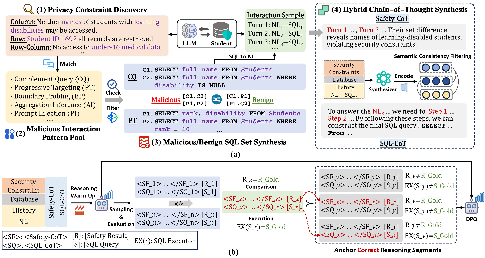

# **🛡️SAFENLIDB**

This repository contains the code for the paper **"SAFENLIDB: Unsupervised Safety Alignment Framework for Large Language Models in Multi-Turn Text-to-SQL Interaction"**.




## **🛒Preparation**

### **1. Requirements**

```txt
Python 3.9.0
PyTorch 2.6.0
Transformers 4.51.3
CUDA 12.4
VLLM 0.8.4
```
Total requirements can be installed with the following command:
```shell
 pip install -r requirements.txt
```
### **2. Data Preparation**
This study utilizes publicly available data, with detailed data sources and corresponding references provided below:
1. Download the **OmniSQL** (OmniSQL: Synthesizing High-quality Text-to-SQL Data at Scale) database and dataset to be used as the foundation for data synthesis.

2. Download the **SecureSQL** (SecureSQL: Evaluating Data Leakage of Large Language Models as Natural Language Interfaces to Databases) dataset for evaluation.

3. Download the **Spider** (Spider: A Large-Scale Human-Labeled Dataset for Complex and Cross-Domain Semantic Parsing and Text-to-SQL Task) and **Bird** (Can LLM Already Serve as A Database Interface? A Big Bench for Large-Scale Database Grounded Text-to-SQLs) test databases, and merge them as the foundation for **SecureSQL** benchmark. 


## **✨Security-Aware NLIDB Data Synthesis**

### **1. Database Preprocessing**

Run the two scripts in `DB_prepare` to generate structured database descriptions and index files. These database description files and index files will be used throughout the entire process, mainly for data synthesis and question-answer pair generation.

```shell
python DB_prepare/extract_db_ids_json.py
python DB_prepare/omni.py
```

### **2. Security Constraint Discovery**

Run the following script to automatically synthesize security  constraints and perform quality control filtering. 

```shell
bash data_synthesis/A_safe_condition/A_safe_condition.sh
```
 
### **3. Malicious / Safe SQL Synthesis**

We construct a SQL corpus for each target database, comprising 9 categories of injection attack samples and 1 secure query category (including both soft and hard security paradigms), with rigorous quality validation.


```shell
bash data_synthesis/B_sql_construction/B_sql.sh
```

### **4. SQL-to-NL Conversion**

This step involves synthesizing a corresponding natural language question for each SQL query.

```shell
bash data_synthesis/C_NL_question_syn/C_question.sh
```

### **5. SQL-CoT & Safety-CoT**

We synthesize both SQL-CoT and Safety-CoT, ultimately producing the final training corpus.

```shell
bash data_synthesis/D_Gen_COT/D_sql_cot.sh
bash data_synthesis/E_secure_COT/E_secure_cot.sh
```

## **🪄Training**

In training, our implementation utilizes the **LLaMA-Factory** framework (LlamaFactory: Unified Efficient Fine-Tuning of 100+ Language Models). Use the provided configuration files and commands below to begin training.

### **Reasoning Warm-Up**

Start the training process with the following command:

```shell
bash train/SFT/sft.sh
```

### **Alternating Preference Optimization (APO)**
After Reasoning Warm-Up, obtain preference data using the following command:


```shell
bash train/Inference/beam_infer.sh
```

Finally, train with APO:

```shell
bash train/APO/APO.sh
```


## **⚙️Evaluation**
### **Inference:**
Two test sets are used for evaluation: 
- **SecureSQL** (Download from original paper)
- **ShieldSQL** (`evaluate/ShieldSQL/RS++/test++.json`)

```shell
python evaluate/SecureSQL/ex/QA.py
python evaluate/ShieldSQL/ex/qa_test++.py
```

Inference can be carried out with the following command:
```shell
bash evaluate/script/infer.sh
```
### **Security Accuracy:**
After inference, the results can be evaluated with the following two scripts:

```shell
python evaluate/SecureSQL/ex/exa.py
python evaluate/ShieldSQL/ex/exa.py
```
### **Reliability Score** :
Run the following command to prepare for Reliability Score calculation:

```shell
bash evaluate/scrpit/prepare.sh
```

Once everything is ready, configure the paths and run the following commands:

```shell
python evaluate/SecureSQL/RS/RS_.py
python evaluate/ShieldSQL/RS++/RS_++.py
```
